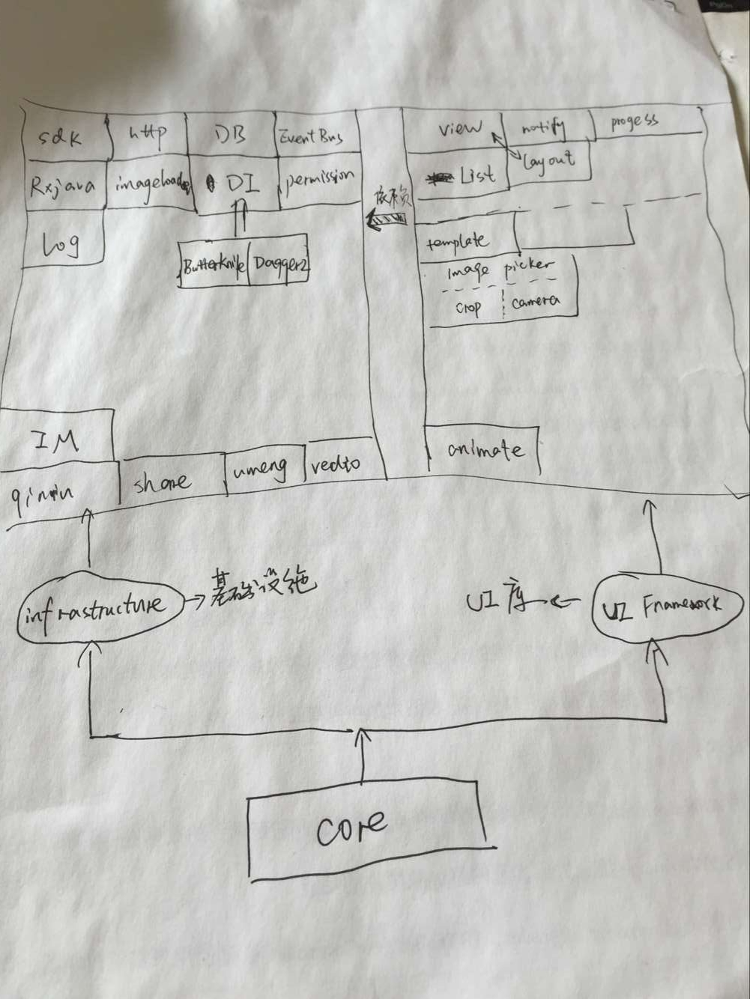

# AyoCore
安卓基础类库，负责mvp，activity框架，初始化，崩溃恢复，权限相关，在其上层是基础设施和UI Framework


* 负责：
    * Activity基本框架：提供Activity，Service管理，统计
    * 提供Activity免声明框架（免manifst）
    * 提供MVP框架
    * Permission
    * Crash恢复
    * 应用初始化

* 基本框架



## 1 Activity基本框架

提供了内置的Activity栈，用于统计页面的打开和关闭，需要所有Activity读都基于AyoActivity或者AyoActivity


## 2 Activity免声明框架

[文档](./doc/README-attacher.md)

## 3 MVP


## 4 Permission相关

[README-ask.md](./doc/README-ask.md)

[README-pop.md](./doc/README-pop.md)

取自：
进一步参考：http://xdeveloper.cn/android6-0quan-xian-gua-pei-bi-ni-xiang-de-huan-yao-jian-dan-2/?hmsr=toutiao.io&utm_medium=toutiao.io&utm_source=toutiao.io

## 5 Crash恢复

取自：https://github.com/Sunzxyong/Recovery
文档：[README-pop.md](./doc/README-recovery.md)

## 6 应用初始化


初始化器，所有程序启动时要做的初始化工作，请放在这里

为什么呢

现在不建议在Application里做所有初始化工作，而是放在SplashActivity

 注意，初始化不完成，SplashActivity不结束，一直完不成初始化，大不了就一直不进应用

 可以允许的失败：可能有些初始化过程允许失败

你还可以把初始化过程分为几步，每一步都对结果进行监听，并作出单独处理

* 剩下的问题就是：
    * 1 初始化放在SpashActivity的哪里，才能保证界面瞬间弹出？
    * 2 对于SpashActivity需要用到的库，也必须做完初始化才能进行，那SpashActivity界面怎么设计呢？
    * 3 有些初始化是比较耗时的，比如视频，IM，Logger等


```java

Initializer.initailizer()
     .addStep(new StepOfCrash())
     .addStep(new StepOfAyoView())
     .addStep(new StepOfAyoSdk())
     .addStep(new StepOfSdCard(agent.getActivity()))
     .addStep(new StepOfLog())
     .addStep(new StepOfHttp())
     .addStep(new StepOfImageLoader())
     .setStepListener(new Initializer.StepListner() {
        @Override
        public boolean onSuffering(Initializer.Step step, boolean isSuccess, int currentStep, int total) {

            //统一判断
            if (!isSuccess && !step.acceptFail()) {
                //退出，提示错误
                Toaster.toastShort(step.getNotify());
                //finish();
                return false;
            }

            //单步逻辑
            if (step.getName().equals("UI Framework")) {
                if(currentStep == total){
                App.isInitialed = true;
                onLoadFinish();
            }

            return true;
        }
    })
    .suffer();

```